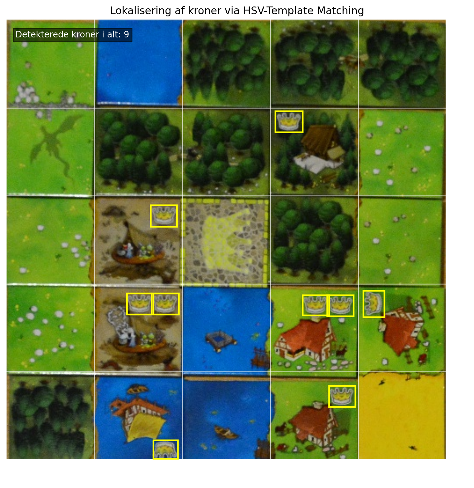
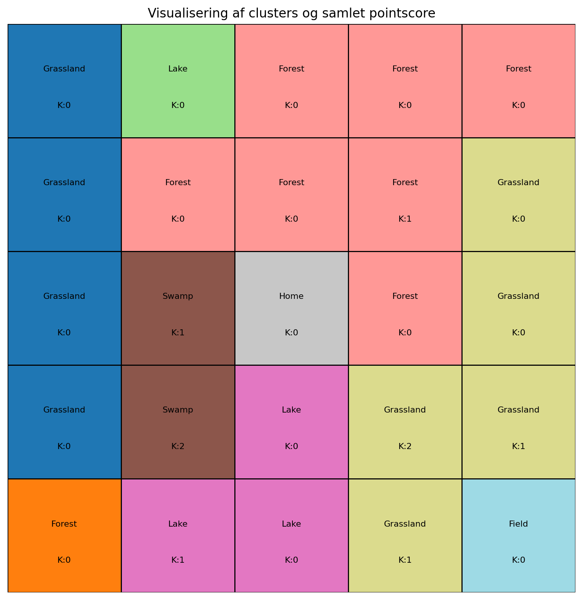

# Kingdomino Pointberegner


Dette er et miniprojekt udviklet på 2. semester på uddannelsen **Design og Anvendelse af Kunstig Intelligens** (Aalborg Universitet).

## Formål
Målet med projektet er at automatisere pointberegningen af afsluttede spilleplader i brætspillet Kingdomino. Ud fra et billede af spillepladen kan systemet automatisk udregne den samlede score og fremvise domænerne visuelt.

## Hvordan er det lavet?
Løsningen er bygget i Python og er opdelt i tre primære pipelines:
1. **Machine Learning:** En Random Forest-model analyserer billedets HSV-farver og klassificerer de forskellige terræntyper på pladens 5x5 felter.
2. **Computer Vision:** Template Matching og Canny Edge Detection bruges til præcist at lokalisere og tælle antallet af kroner.
   
   

3. **Algoritmik:** En Flood-Fill algoritme samler ensartede naboterræner til lukkede områder (clusters) og beregner den korrekte score ud fra spillets regler (areal ganget med kroner).

   

## Kom i gang
Installer dependencies fra projektroden:

```bash
pip install -r requirements.txt
```

Kør hovedprogrammet:

```bash
python kingdomino.py
```

## Udviklere
Daniel Rom Kristiansen & Oliver Richard Lundstrøm